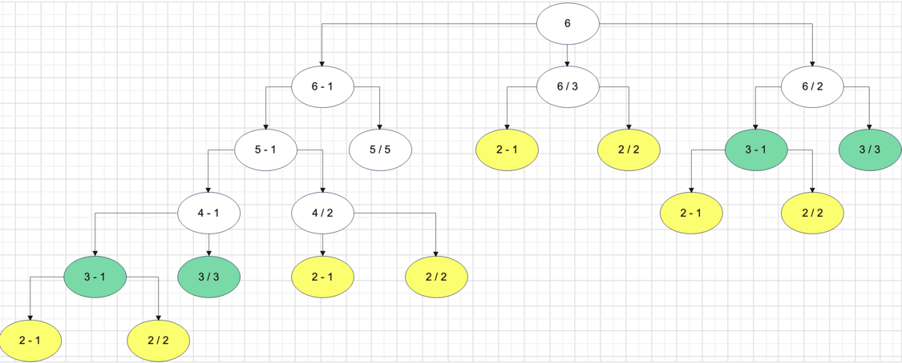

# 1로 만들기

## 문제

정수 X에 사용할 수 있는 연산은 다음과 같이 세 가지 이다.

* X가 5로 나누어 떨어지면, 5로 나눈다.
* X가 3으로 나누어 떨어지면, 3으로 나눈다.
* X가 2로 나누어 떨어지면, 2로 나눈다.
* 1을 뺀다.

정수 N이 주어졌을 때, 위와 같은 연산 4개를 적절히 사용해서 1을 만들려고 한다.<br>
연산을 사용하는 횟수의 최솟값을 출력하시오.<br>
예를 들어, 26은 `26 -> 25 -> 5 -> 1`로 3번이 최솟값이다.

### 입력 조건

```
26
```
```
10
```

### 출력 조건

```
3
```
```
2
```


## 해설

다음은 6이 주어졌다고 가정했을 때, 발생할 수 있는 경우의 수들이다.



그래프를 통해 `최적 부분 구조(큰 문제가 작은 문제로 쪼개짐)`과 `중복되는 부분 문제`를 만족한다는 것을 알 수 있다.

* (n - 1)은 무조건 발생한다.
* 2, 3, 5로 나눠떨어지는 경우가 1개 이상 존재한다.
* 최대 연산의 수는 최대 5(2~6)다.

여기서 최소 횟수를 구하기 위해 중복 연산이 제일 많은 2부터 `bottom up` 방식으로 최소 연산 횟수를 dp 테이블에 저장해나가면 된다.

1. dp[2 - 1]과 dp[2 / 2]는 연산횟수가 0회이므로 `dp[2] = 0 + 1 = 1`이다.
2. dp[3 - 1]의 연산횟수가 1회고, dp[3 / 3]은 연산횟수가 0회로 최소 연산인 dp[3 / 3]을 사용하여 `dp[3] = 0 + 1 = 1`이다.
3. dp[4 - 1]은 연산횟수가 1회고, dp[4 / 2]는 연산횟수가 1회로 `dp[4] = 1 + 1 = 2`이다.
4. dp[5 - 1]은 연산횟수가 2회고, dp[5 / 5]는 연산횟수가 0회로 최소 연산인 dp[5 / 5]을 사용하여 `dp[5] = 0 + 1 = 1`이다.
5. dp[6 - 1]은 연산횟수가 1회고, dp[6 / 3]은 연산횟수가 1회고, dp[6 / 2]는 연산횟수가 1회로 `dp[6] = 1 + 1 = 2`이다.

결과적으로 위 과정들을 `a(i) = min(a(i-1), a(i/2), a(i/3), a(i/5)) + 1`로 일반화 할 수 있다.<br>
다만, a(i/2), a(i/3), a(i/5)는 나눠 떨어지는 경우에만 해당한다.

> [작성 코드](https://github.com/Java-Algorithm-Study-Group/this-is-coding-test/blob/main/seungjun/src/dynamic_programming/Example1.java)